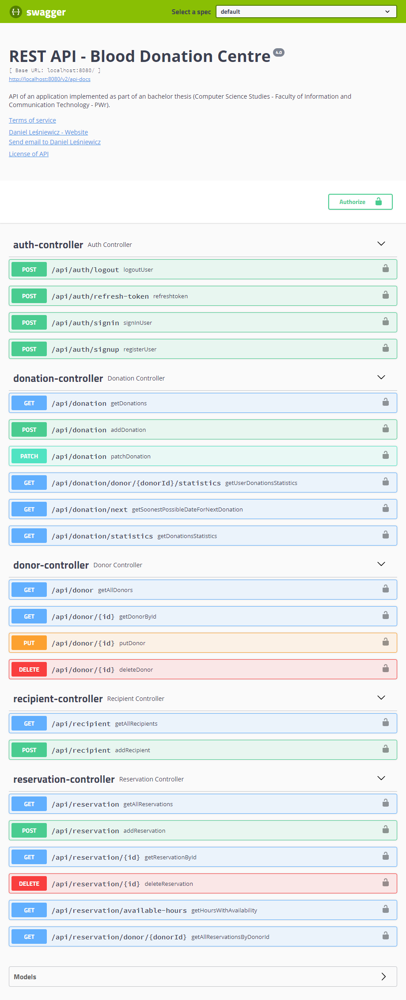

# BloodDonationCentre Application

The repository contains a Spring Boot REST API application for managing the blood centre.

## Technologies:

Core technologies used in the project:

* Spring Boot
* Spring Web
* Spring Data JPA
* Spring Security
* Project Lombok
* MySQL DB

## Key application features:

* User registration and authentication with JWT
* Logged donor can:
    * book an appointment for blood or plasma donation
    * view new/archived reservations and donations
    * view statistics about donations
* Logged employee can:
    * manage the donors' personal data
    * manage donations,
    * book appointments for donations
    * mark the release of doses of biological material to other entities
* Admin can manage all employees in donation centre
* The system takes care of providing the appropriate interval between donations

## Swagger API:

